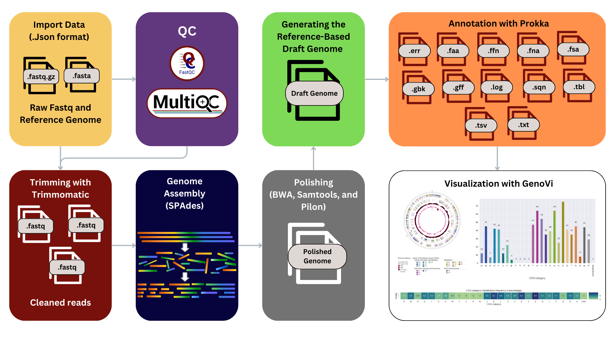

# Summary

`Prokaryome` is an open-source workflow designed to facilitate prokaryotic genome assembly, polishing, annotation, and visualization. Built using the 
`Workflow Description Language (WDL)`, it streamlines the analysis of paired-end sequencing data from raw reads to polished, annotated genomes. The 
pipeline includes essential preprocessing steps such as quality control, sequence trimming, and error correction, as well as advanced assembly polishing 
and genome annotation. `Prokaryome` ensures high-quality genome assemblies by incorporating four rounds of polishing for the assembled reads to decrease the error rate of the assembly process, and provide visualizations and detailed reports of the assembly quality and the annotated features, to make it a comprehensive tool for microbiome research and comparative genomics.

# Statement of need

Prokaryotic genome analysis is a very critical component of any microbiome research that can enable researchers to investigate the microbial diversity, 
functionality, and evolutionary relationships [@rajguru2024exploring]. However, this process is often fragmented and requiring multiple tools and 
workflows that demand a high level of technical expertise and high coding skills. So, many researchers face challenges in integrating these tools, 
ensuring compatibility, and maintaining reproducibility across their analyses. These challenges are further compounded by the need to process large 
datasets efficiently while maintaining high-quality outputs. 

Traditional workflows for prokaryotic genome assembly and annotation typically involve manual execution of individual steps, such as quality control 
[@patel2012ngs], trimming [@lee2021trimming, kong2011btrim, macmanes2014optimal], assembly [@wick2017unicycler], polishing, and annotation 
[@zimin2020genome]. This not only increases the risk of errors but also makes the process time-consuming and difficult to replicate. Moreover, existing 
pipelines often fail to provide a seamless transition between steps or to include robust visualization features, which are critical for interpreting and 
presenting results effectively. Prokaryome, our proposed tool, addresses these challenges by integrating all essential steps into a single, streamlined 
pipeline. Designed with a focus on reproducibility, ease of use by all researcher, and comprehensive functionality. It designed by the Workflow 
Description Language (WDL) which is a domain-specific language designed to facilitate the development and execution of complex bioinformatics workflows 
efficiently [@van2020genomics]. It takes the raw fastq sequencing data and automates the entire genome assembly process to the generation of annotated 
genomes and visualizations. As shown in \autoref{fig:prokfig}, the workflow begins with FastQC and MultiQC [@ewels2016multiqc], which assesses the quality 
of raw reads, followed by Trimmomatic, which trims low-quality bases [@bolger2014trimmomatic]. The cleaned reads are then assembled into contigs and 
scaffolds using SPAdes [@bankevich2012spades], generating a draft genome. The draft undergoes four iterative rounds of polishing with BWA, Samtools, and 
Pilon [@jung2022bwa; @danecek2021twelve; @walker2014pilon], enhancing assembly accuracy. QUAST evaluates the assembly quality against a reference genome 
[@gurevich2013quast], while RagTag scaffolds the polished assembly to produce a draft genome aligned to the reference [@alonge2022automated]. The draft is 
further refined using a customized python script, annotated with Prokka to identify genomic features [@seemann2014prokka], and lastly, the draft genome is 
visualized with Genovi, generating comprehensive reports and graphical summaries for downstream analysis  [@cumsille2023genovi].

# Acknowledgements

I would like to acknowledge Dr. Mohamed Farahat, Postdoctoral Fellow in the Computational Biology Division at the University of Cape Town's Faculty of 
Health Sciences, for his unwavering support and invaluable guidance throughout this project.

# References
